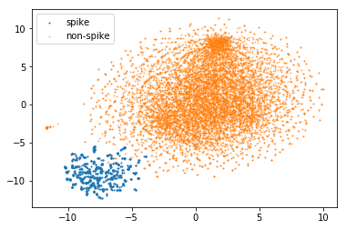

# FastSeq: Locality Sensitive Vector Representation of DNA Sequences

## Summary

FastSeq is a k-mer embedding software which extends [FastText](https://fasttext.cc/) . It applies LSH (Locality Sensitive Hashing) to reduce the size of k-mer vocabulary and improve the performance of embedding.  

To cite FastSeq: 

## Requirements

Here is the environment I worked on.  Other versions may also work. Python 3 should work, but I don't use it a lot.

1. Linux, gcc with C++11
2. Python 2.7 or Python 3.6
   - joblib 0.12.4
   - tqdm 4.28.1
   - numpy 1.15.0
   - pandas 0.23.4
   - sklearn 0.19.1 (only for evaluation)
   - MulticoreTSNE (only for visualization)
   - cython 0.28.5
   - csparc (included)

## Build 

- clone from git

  `git clone https://LizhenShi@bitbucket.org/LizhenShi/lshvec.git`

  `cd lshvec`

- install csparc which wraps a c version of k-mer generator I used in another project

  for python 2.7

  `pip install pysparc-0.1-cp27-cp27mu-linux_x86_64.whl`

  or for python 3.6

  `pip install pysparc-0.1-cp36-cp36m-linux_x86_64.whl`

  or for python 3.7

  `pip install pysparc-0.1-cp37-cp37m-linux_x86_64.whl`

- make 

  `make`

## Examples

A toy example, which is laptop friendly and should finish in 10 minutes,  can be found in [Tutorial_Toy_Example.ipynb](notebook/Tutorial_Toy_Example.ipynb). Because of randomness the result may be different.

A practical example which uses ActinoMock Nanopore data can be found at [Tutorial_ActinoMock_Nanopore.ipynb](notebook/Tutorial_ActinoMock_Nanopore.ipynb). The notebook ran on a 16-core 64G-mem node and took a few hours (I think 32G mem should work too).

​						 

## Command line options

### fastqToSeq.py

convert a fastq file to a seq file

    python fastqToSeq.py -i <fastq_file> -o <out seq file> -s <1 to shuffle, 0 otherwise>

###  hashSeq.py

Encode reads in a seq file use an encoding method.

    python hashSeq.py -i <seq_file> --hash <fnv or lsh> -o <outfile> [-k <kmer_size>] [--n_thread <n>] [--hash_size <m>] [--batch_size <n>] [--bucket <n>] [--lsh_file <file>] [--create_lsh_only]
    
      --hash_size <m>:        only used by lsh which defines 2^m bucket.
      --bucket <n>:           number of bucket for hash trick, useless for onehot.
       				          For fnv and lsh it limits the max number of words.
       				          For lsh the max number of words is min(2^m, n).
      --batch_size <b>:       how many reads are processed at a time. A small value uses less memory.

### lshvec

Please refer to [fasttext options](https://fasttext.cc/docs/en/options.html).  However note that options of `wordNgrams`, `minn`,`maxn` does not work with lshvec.

## Questions

-  `lshvec` gets stuck at `Read xxxM words` 

  Search `MAX_VOCAB_SIZE` in the source code and change it to a bigger one.  When a word's index is bigger than that number, a loop is carried to query it, which is costly. The number is 30M in FastText which is good for languages. But it is too small for k-mers. The number has been already increased to 300M in FastSeq. But for large and/or high-error-rate data, it may be still not enough.

- I have big data 

  hashSeq reads all data into memory to sample k-mers for hyperplanes. If data is too big it may not fit into memory. One can 

  1. Try sampling. DNA reads generally have high coverage. Such high coverage may not be necessary. 
  2. Or use `create_hash_only` to create lsh on a small (sampled) data; then split your data into multiple files and run hashSeq with `lsh_file` option on many nodes.

## License

Inherit license from FastText which is BSD License

