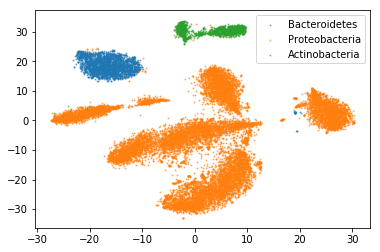
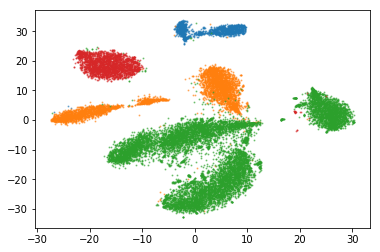
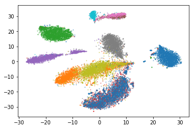

```python
import os
import pandas as pd
from MulticoreTSNE import MulticoreTSNE as TSNE
%pylab inline
```

    Populating the interactive namespace from numpy and matplotlib


```python
!mkdir -p sandbox #let's put all stuff in the sandbox
os.chdir("sandbox")
```

### Download a sample of ActinoMock Nanopore data


```python
if not os.path.exists('ActinoMock_Nanopore.seq.gz'):
    !wget https://s3.amazonaws.com/lizhen-notebook/share/ActinoMock_Nanopore.seq.gz
```

    --2019-01-25 06:05:17--  https://s3.amazonaws.com/lizhen-notebook/share/ActinoMock_Nanopore.seq.gz
    Resolving s3.amazonaws.com (s3.amazonaws.com)... 52.216.176.229
    Connecting to s3.amazonaws.com (s3.amazonaws.com)|52.216.176.229|:443... connected.
    HTTP request sent, awaiting response... 200 OK
    Length: 480042209 (458M) [application/x-gzip]
    Saving to: ‘ActinoMock_Nanopore.seq.gz’
    
    ActinoMock_Nanopore 100%[===================>] 457.80M  72.6MB/s    in 6.6s    
    
    2019-01-25 06:05:24 (69.7 MB/s) - ‘ActinoMock_Nanopore.seq.gz’ saved [480042209/480042209]


```python
!cat ActinoMock_Nanopore.seq.gz | gunzip > data.seq
```

### encode  reads


```python
!python ../../scripts/fastseq/hashSeq.py -i data.seq --hash lsh -o data.hash -k 15 --hash_size 25 --bucket 67108864 > /dev/null  2> error.log
```


### train a model


```python
#change epoch to 1 to save time
!../../fastseq skipgram -input data.hash -output model  -epoch 5 -dim 100 -lr 0.1
```

    Read 1639M words
    Number of words:  6838356
    Number of labels: 0
    Progress: 100.0% words/sec/thread:   50888 lr:  0.000000 loss:  0.068224 ETA:   0h 0mm 


### Now the model is trained.  To visualize it, first get vectors of reads. 


```python
def read_embedding(fname):
    with open(fname) as fin:
        lines=list(fin)
    assert len(lines)>1
    first_line=lines[0]
    num_word, dim_vec = [int(u) for u in first_line.split(" ")]
    assert len(lines)==num_word+1
    ret ={}
    for line in lines[1:]:
        lst = line.strip().split(" ")
        assert len(lst)==dim_vec+1, line
        if lst[0]=='</s>': continue
        word = int(lst[0])
        vec = np.array([float(u) for u in lst[1:]])
        ret[word]=vec
    return ret,dim_vec

embedding,dim_vec = read_embedding("model.vec")
seqvectors = []
lines=[]
with open("data.hash") as fin:
    for line in fin:
        if len(lines)>=20000: break  #The data is already shuffled, so just take a few from head
        lines.append(line)
for i,line in enumerate(lines):
    words = [int(u) for u in line.strip().split(" ")]
    vec = [embedding[u] for u in words if u in embedding]
    seqvectors.append(np.mean(vec,0) if len(vec)>0 else None)#np.zeros([dim_vec],dtype=np.float32))
    #if i>10: break    
```

### Next get the labels


```python
seqs = pd.read_csv("data.seq",sep='\t', header=None, usecols=[0,1],index_col=0, nrows=20000)
seqs.columns=['id']
seqs['organism']=seqs['id'].map(lambda u: u.split('-')[1])
seqs['class']=seqs['id'].map(lambda u: u.split('-')[2])
seqs['phylum']=seqs['id'].map(lambda u: u.split('-')[3])
seqs['vec']=seqvectors
seqs.head()
```


### Now train TSNE


```python
tsne = TSNE(n_components=2, perplexity=100, n_jobs=8)
X=np.array(list(seqs['vec'].values))
X.shape
```


    (20000, 100)


```python
%time Y = tsne.fit_transform(X)
```

    CPU times: user 10min 43s, sys: 13.6 s, total: 10min 57s
    Wall time: 1min 24s


### visualization


```python
labels=seqs['phylum'].values
legends=list(set(labels))
for label in legends:            
    plt.scatter(Y[labels==label][:,0],Y[labels==label][:,1],alpha=0.5,s=1)
plt.legend(legends)
```


    <matplotlib.legend.Legend at 0x7fa2c8430a10>





```python
labels=seqs['class'].values
legends=list(set(labels))
print (legends)
for label in legends:            
    plt.scatter(Y[labels==label][:,0],Y[labels==label][:,1],alpha=0.5,s=1)
```

    ['Actinobacteria', 'Alphaproteobacteria', 'Gammaproteobacteria', 'Flavobacteriia']





```python
labels=seqs['organism'].values
legends=list(set(labels))
print (legends)
for label in legends:            
    plt.scatter(Y[labels==label][:,0],Y[labels==label][:,1],alpha=0.5,s=1)
```

    ['2617270709', '2616644829', '2615840527', '2623620617', '2615840533', '2623620567', '2623620557', '2615840601', '2615840697', '2615840646', '2623620618']




